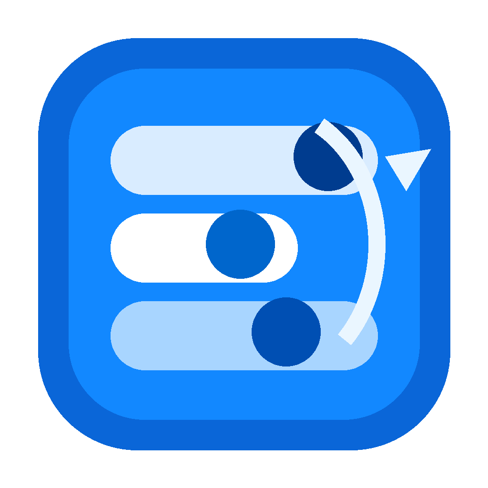
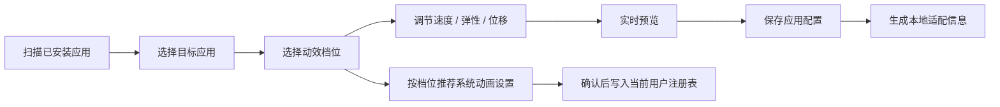
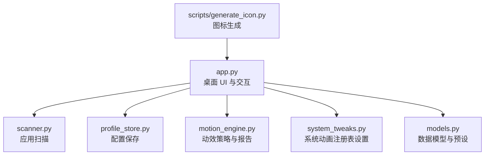
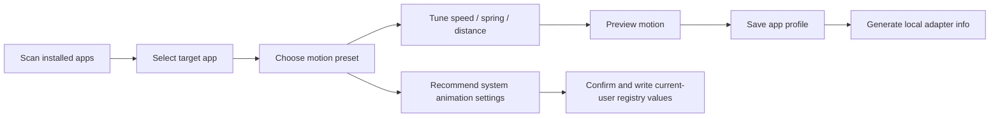
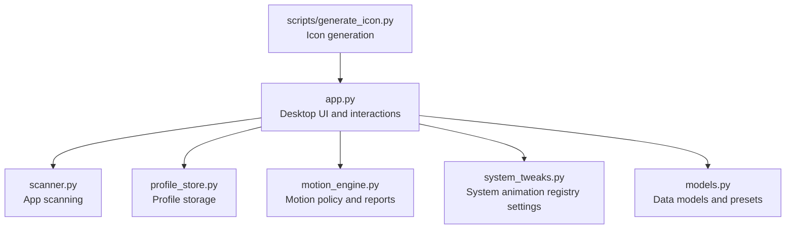

# Windows Motion Studio

<p align="center">
  
</p>

<p align="center">
  <strong>一个用于 Windows 动效手感配置、UI 动效探索和个人桌面美化的小工具。</strong>
</p>

<p align="center">
  <a href="https://github.com/kotorin-Y/Some-tools.../releases/tag/windows-motion-studio-v0.2.0">Download Release</a>
  ·
  <a href="./ADAPTERS.md">Adapter Notes</a>
  ·
  <a href="#english">English</a>
</p>

---

## 中文说明

### 项目用途

Windows Motion Studio 是一个面向 Windows 桌面体验的小工具。我做它的初衷，是想把“动画开关”之外的动效手感也变成可以观察、保存和调节的东西。

它目前可以扫描本机应用，为不同应用保存独立的动效偏好，同时提供少量可实际落地的 Windows 系统动画调节。它也可以作为一个轻量的 UI 动效实验台，用来尝试速度、弹性、位移等参数对界面感受的影响。

这个项目适合这些场景：

- 个人桌面美化：给不同类型的应用保存不同的操作节奏。
- UI 设计探索：快速预览动效参数对界面手感的影响。
- 产品体验研究：比较“高效、柔和、活力、极简”等不同动效风格。
- Windows 小工具开发：作为 Python 桌面工具、注册表设置、应用扫描的参考项目。
- 应用适配器实验：为后续接入特定软件的公开配置、插件 SDK 或扩展接口打基础。

### 当前功能

| 模块 | 功能 |
| --- | --- |
| 应用扫描 | 扫描 Win32 应用，并可选扫描 Microsoft Store / AppX 应用 |
| 应用动效档位 | 支持均衡、高效、柔和、活力、极简、自定义 |
| 参数调节 | 支持速度倍率、弹性强度、位移幅度 |
| 场景配置 | 支持页面切换、浮层弹窗、拖拽吸附、通知反馈 |
| 实时预览 | 使用本地 Canvas 绘制预览动画，不依赖 Web 服务 |
| 系统动画 | 读取和写入少量当前用户范围的 Windows 动画注册表项 |
| 配置管理 | 支持 JSON 配置保存、导入和导出 |
| 构建发布 | 支持通过 PyInstaller 打包成单文件 exe |

### 技术栈

| 层级 | 技术 |
| --- | --- |
| 语言 | Python 3 |
| 桌面 UI | Tkinter / ttk |
| 本地预览 | Tkinter Canvas |
| Windows 能力 | `winreg`、PowerShell、注册表读取与写入 |
| 应用扫描 | Windows Uninstall Registry、AppX Package 查询 |
| 配置存储 | JSON |
| 图标生成 | Pillow |
| 打包 | PyInstaller |

### 系统动画调节

工具目前会读写这些当前用户注册表项：

- `HKCU\Control Panel\Desktop\WindowMetrics\MinAnimate`
- `HKCU\Control Panel\Desktop\MenuShowDelay`
- `HKCU\Software\Microsoft\Windows\CurrentVersion\Explorer\VisualEffects\VisualFXSetting`
- `HKCU\Software\Microsoft\Windows\CurrentVersion\Explorer\Advanced\TaskbarAnimations`

这些设置都在当前用户范围内，不需要管理员权限。部分设置可能需要注销、重新登录或重启 Explorer 后才会完全生效。

写入前工具会弹出确认窗口，不会静默修改注册表。

### 工作流程



### 项目结构



### 设计边界

Windows 没有提供一个统一接口，可以直接修改任意第三方应用内部动画。这个项目不会注入进程、Hook 渲染管线、反编译软件，也不会修改第三方 exe/dll。

应用级配置目前更像一个“策略库”：它会保存每个应用的动效偏好，并生成可审计的本地适配信息。以后如果某个应用提供公开配置、插件 SDK 或扩展接口，可以在这个基础上继续做专用适配。

### 可应用领域

- **UI / UX 动效设计**：用于快速验证不同动效参数对界面感受的影响。
- **个人桌面美化**：为办公、开发、设计、娱乐类应用保存不同动效偏好。
- **Windows 辅助体验微调**：结合减少动画、任务栏动画、菜单延迟等系统设置进行细化。
- **桌面效率工具**：面向高频操作场景，提供更快、更收束的动效策略。
- **应用适配器原型**：为浏览器、编辑器、创意软件等工具的专用适配器提供基础结构。

### 未来可以补充的功能

#### 1. 更完整的系统外观设置

- Windows 透明效果开关。
- 深色 / 浅色主题跟随策略。
- 任务栏、窗口、菜单相关的更多可公开设置。
- Explorer 重启提示或一键重启选项。

#### 2. 应用适配器系统

- 为 VS Code、浏览器等支持配置文件或扩展接口的软件建立专用适配器。
- 为每个适配器提供“可写入项、风险提示、回滚方式”。
- 把当前的动效配置导出为适配器可消费的标准结构。

#### 3. 更强的动效预览

- 增加多个预览模板：侧边栏、弹窗、列表、卡片、通知、窗口切换。
- 支持导出动效参数为 JSON、CSS easing、设计文档片段。
- 增加关键帧曲线和弹性曲线可视化。

#### 4. 配置备份与回滚

- 写入注册表前自动保存旧值。
- 提供一键恢复默认值。
- 支持配置快照、命名方案和跨设备迁移。

#### 5. 更适合设计工作的输出

- 生成 PRD / 设计说明里的动效参数表。
- 输出可用于 Figma、前端实现或设计系统的 motion token。
- 支持按产品类型生成推荐动效档位。

### 运行源码

```powershell
pip install -e .
windows-motion-studio
```

也可以直接运行模块：

```powershell
$env:PYTHONPATH="src"
python -m windows_motion_studio
```

### 构建 exe

```powershell
powershell -NoProfile -ExecutionPolicy Bypass -File .\build.ps1
```

构建脚本会安装构建依赖、生成应用图标，并使用 PyInstaller 打包单文件 exe。

---

<a id="english"></a>

## English

### What This Project Is For

Windows Motion Studio is a small utility for tuning the feel of motion on Windows. I started it because desktop animation settings are often reduced to a broad on/off choice, while the actual feel of an interface depends on smaller details such as speed, spring strength, distance, and transition context.

The tool can scan local apps, store per-app motion preferences, and adjust a small set of practical Windows animation settings. It can also be used as a lightweight playground for UI motion design, personal desktop customization, and future app-specific adapter experiments.

This project can be useful for:

- Personal desktop customization: store different motion preferences for different types of apps.
- UI motion exploration: preview how speed, spring, and distance affect interface feel.
- Product experience research: compare efficient, calm, expressive, and minimal motion styles.
- Windows utility development: reference Python desktop UI, registry settings, and app scanning logic.
- Adapter prototyping: prepare a structure for apps that expose public settings, plugin SDKs, or extension APIs.

### Current Features

| Module | Feature |
| --- | --- |
| App scanning | Scans Win32 apps and can optionally scan Microsoft Store / AppX apps |
| Motion presets | Balanced, Efficient, Calm, Expressive, Minimal, and Custom |
| Parameter tuning | Speed multiplier, spring strength, and motion distance |
| Scenario settings | Page transitions, overlays, drag snapping, and notifications |
| Live preview | Local Canvas-based animation preview without web services |
| System animation | Reads and writes a small set of current-user Windows animation registry values |
| Profile management | JSON profile save, import, and export |
| Build | Single-file exe packaging with PyInstaller |

### Tech Stack

| Layer | Technology |
| --- | --- |
| Language | Python 3 |
| Desktop UI | Tkinter / ttk |
| Local preview | Tkinter Canvas |
| Windows integration | `winreg`, PowerShell, registry read/write |
| App scanning | Windows Uninstall Registry, AppX Package query |
| Storage | JSON |
| Icon generation | Pillow |
| Packaging | PyInstaller |

### System Animation Tweaks

The app currently reads and writes these current-user registry values:

- `HKCU\Control Panel\Desktop\WindowMetrics\MinAnimate`
- `HKCU\Control Panel\Desktop\MenuShowDelay`
- `HKCU\Software\Microsoft\Windows\CurrentVersion\Explorer\VisualEffects\VisualFXSetting`
- `HKCU\Software\Microsoft\Windows\CurrentVersion\Explorer\Advanced\TaskbarAnimations`

These settings are scoped to the current user and do not require administrator privileges. Some changes may require signing out, signing back in, or restarting Explorer to fully apply.

The app asks for confirmation before writing registry values.

### Workflow



### Structure



### Scope

Windows does not expose a universal API for changing the internal animation behavior of arbitrary third-party apps. This project does not inject into processes, hook rendering pipelines, decompile software, or modify third-party exe/dll files.

Per-app configuration currently works as a policy layer: it stores motion preferences for each app and produces auditable local adapter information. If an app provides public settings, a plugin SDK, or an extension API, app-specific adapters can be added later.

### Application Areas

- **UI / UX motion design**: quickly test how motion parameters affect perceived feel.
- **Personal desktop customization**: store different motion preferences for work, development, design, and entertainment apps.
- **Windows accessibility and comfort tuning**: refine animation-related system preferences.
- **Desktop productivity utilities**: use faster and tighter motion settings for high-frequency workflows.
- **App adapter prototypes**: provide a base structure for browser, editor, or creative-tool adapters.

### Future Ideas

#### 1. More Windows appearance controls

- Transparency effects.
- Dark / light theme follow strategy.
- More public settings for taskbar, windows, and menus.
- Explorer restart prompt or one-click restart option.

#### 2. App adapter system

- Dedicated adapters for tools such as VS Code and browsers.
- Adapter metadata for writable settings, risk notes, and rollback steps.
- A standard profile format that adapters can consume.

#### 3. Better motion previews

- More preview templates: sidebar, modal, list, card, notification, and window switching.
- Export motion parameters as JSON, CSS easing, or design documentation snippets.
- Visualize keyframe curves and spring curves.

#### 4. Backup and rollback

- Automatically save previous registry values before writing.
- One-click restore defaults.
- Named snapshots and cross-device profile migration.

#### 5. Design-friendly output

- Generate motion parameter tables for PRDs or design notes.
- Export motion tokens for design systems or implementation handoff.
- Recommend motion presets by product type.

### Run From Source

```powershell
pip install -e .
windows-motion-studio
```

Or run the module directly:

```powershell
$env:PYTHONPATH="src"
python -m windows_motion_studio
```

### Build The Executable

```powershell
powershell -NoProfile -ExecutionPolicy Bypass -File .\build.ps1
```

The build script installs build dependencies, generates the app icon, and packages a single-file exe with PyInstaller.
